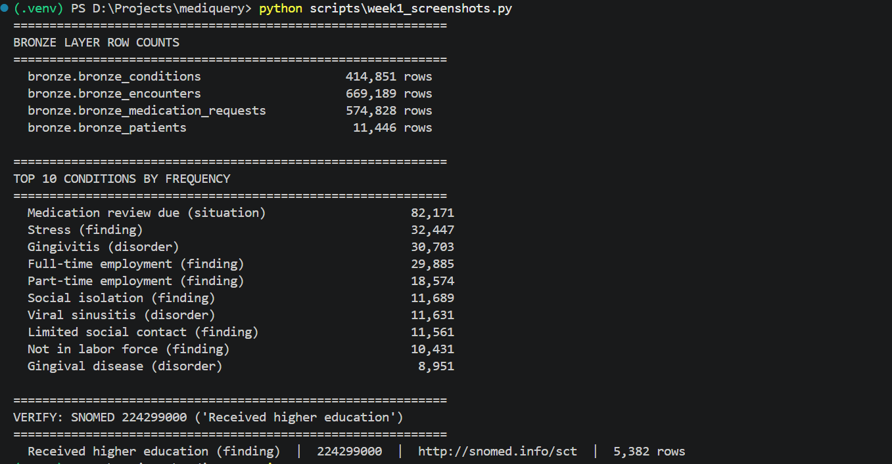

# MediQuery

Clinical analytics platform with safety-first AI. Synthetic FHIR data flows through a DuckDB Medallion lakehouse, gets modeled as a Neo4j knowledge graph, and is queried through a GraphRAG agent with mandatory citation guards.

**Stack:** Synthea, Python, DuckDB, dbt, Neo4j, LangChain, Ollama, Streamlit

## The clinical data problem this project addresses

Most healthcare data tutorials treat the FHIR `Condition` resource as a list of diseases. It's not. Running a top-10 conditions query on 11,446 synthetic patients revealed that **7 of the 10 most common "conditions" are not clinical disorders** — they're social factors (stress, social isolation), administrative events (medication review due), or employment status.

| Rank | Condition | Count | Type |
|---|---|---|---|
| 1 | Medication review due (situation) | 82,171 | Administrative |
| 2 | Stress (finding) | 32,447 | Social factor |
| 3 | Gingivitis (disorder) | 30,703 | Clinical |
| 4 | Full-time employment (finding) | 29,885 | Social factor |
| 5 | Part-time employment (finding) | 18,574 | Social factor |
| 6 | Social isolation (finding) | 11,689 | Social factor |
| 7 | Viral sinusitis (disorder) | 11,631 | Clinical |
| 8 | Limited social contact (finding) | 11,561 | Social factor |
| 9 | Not in labor force (finding) | 10,431 | Social factor |
| 10 | Gingival disease (disorder) | 8,951 | Clinical |

A naive "patients with conditions" query inflates cohorts by counting employed people as sick. This project's Silver layer separates them using SNOMED hierarchy classification — a step most Synthea tutorials skip.

## Status

**Week 1 of 6 complete.** Bronze layer of a Medallion lakehouse loaded with 11,446 synthetic patients and 1.67M clinical records.

## What's built so far

- Synthea generating 11,446 synthetic Massachusetts patient bundles
- FHIR parser extracting 4 resource types (Patient, Encounter, Condition, MedicationRequest) into typed Python dicts
- Batch driver scaling parser to all 11,446 bundles with error handling and parquet intermediate output (zero failures)
- DuckDB lakehouse with Bronze/Silver/Gold schemas and audit columns
- Bronze loader using DuckDB's native `read_parquet()` — loads 1.67M rows in ~5 seconds with self-verifying row counts

## Bronze layer row counts

| Table | Rows |
|---|---|
| bronze_patients | 11,446 |
| bronze_encounters | 669,189 |
| bronze_conditions | 414,851 |
| bronze_medication_requests | 574,828 |

## Stack rationale

- **DuckDB** instead of Snowflake — Snowflake's 30-day trial expires mid-project. DuckDB gives the same SQL surface, same dbt workflow, indefinite demo lifetime. SQL is portable to Snowflake/BigQuery if needed.
- **Ollama** instead of OpenAI API — local LLM, no API costs, no rate limits.
- **dbt** for Silver/Gold transformations — industry-standard analytics engineering tool.
- **Neo4j Aura** free tier for the clinical knowledge graph.

## Roadmap

- ✅ Week 1: FHIR ingestion + Bronze layer
- 🚧 Week 2: dbt Silver transformations (with SNOMED hierarchy classification)
- ⬜ Week 3: Gold clinical metrics (readmissions, chronic conditions, adherence)
- ⬜ Week 4: Neo4j knowledge graph
- ⬜ Week 5: GraphRAG agent with citation guards
- ⬜ Week 6: Multi-persona dashboard + anomaly detection benchmarks

## Design decisions

See `docs/design_decisions.md` for the rationale behind non-obvious choices (e.g., SNOMED hierarchy classification, DuckDB over cloud warehouses).