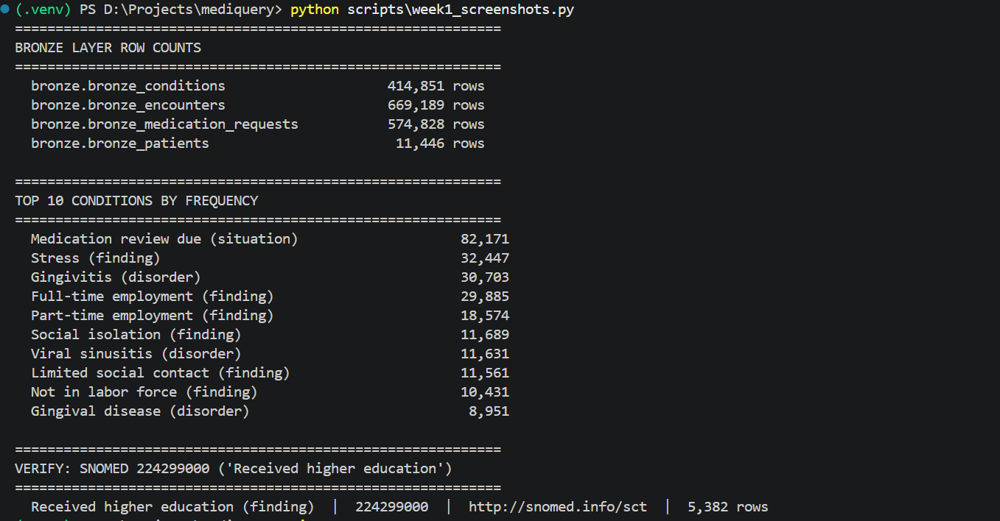

# MediQuery

**MediQuery** is a 6-week clinical analytics build. Synthetic FHIR patient
data flows through a DuckDB Medallion lakehouse (built), a Neo4j knowledge
graph (Week 4), and a GraphRAG agent with mandatory citation guards (Week 5).
Currently at end of Week 2 — Silver layer complete with 33 dbt tests and a
Python distribution-validation suite catching two synthetic-data quality
issues Synthea documentation doesn't mention.

**Stack:** Synthea · Python · DuckDB · dbt · Neo4j · LangChain · Ollama · Streamlit

## The clinical data problem this project addresses

Most healthcare data tutorials treat the FHIR `Condition` resource as a list of diseases. It's not. Running a top-10 conditions query on 11,446 synthetic patients revealed that **7 of the 10 most common "conditions" are not clinical disorders** — they're social factors (stress, social isolation), administrative events (medication review due), or employment status.

| Rank | Condition | Count | Type |
|---|---|---|---|
| 1 | Medication review due (situation) | 82,171 | Administrative |
| 2 | Stress (finding) | 32,447 | Social factor |
| 3 | Gingivitis (disorder) | 30,703 | Clinical |
| 4 | Full-time employment (finding) | 29,885 | Social factor |
| 5 | Part-time employment (finding) | 18,574 | Social factor |
| 6 | Social isolation (finding) | 11,689 | Social factor |
| 7 | Viral sinusitis (disorder) | 11,631 | Clinical |
| 8 | Limited social contact (finding) | 11,561 | Social factor |
| 9 | Not in labor force (finding) | 10,431 | Social factor |
| 10 | Gingival disease (disorder) | 8,951 | Clinical |

A naive "patients with conditions" query inflates cohorts by counting employed people as sick. The Silver layer separates them using SNOMED hierarchy classification: **only 32.7% of 414,851 conditions are actual disorders.** The remaining 67% are findings (45.4%) and situations (22%). Cohort queries hit `is_billable_diagnosis` or `condition_flag`, never raw SNOMED codes.



## Status

**Days 1–13 of 42 complete.** Bronze + Silver layers built. 33 dbt tests and 14 Python distribution assertions passing.

## What's built so far

- Synthea generating 11,446 synthetic Massachusetts patient bundles
- FHIR parser handling 5 resource types (Patient, Encounter, Condition, MedicationRequest, Observation), including the `medicationReference` fallback that affects 35% of medication rows
- Bronze loader using DuckDB's native `read_parquet()` — 1.67M rows in ~5 seconds
- Silver layer with 5 dbt models:
  - `silver_conditions` with SNOMED hierarchy classification (disorder / finding / situation / unknown)
  - `silver_medications` with therapeutic cohort flags and 15-class drug classification
  - `silver_observations` with `is_plausible_value` and `is_critical_value` flags
  - All foreign-key relationships against `silver_patients` verified (zero orphans)
- 33 dbt schema tests passing (unique, not_null, accepted_values, relationships)
- Python validation suite enforcing every quantitative claim in `docs/design_decisions.md`

## Data quality

Two layers of validation on the silver tier.

**dbt tests** cover schema invariants: primary key uniqueness, not-null constraints, enum values, foreign keys. Run via `dbt test --select silver`.

**Python validation suite** (`tests/validate_silver.py`) covers distribution claims that dbt cannot:

- DD-001 SNOMED classification: disorder share 0.30–0.36 (actual 0.327), finding share 0.42–0.48 (actual 0.454)
- DD-002 Synthea HbA1c plausibility: 49% of HbA1c readings are clinically impossible (<4.0%, incompatible with life). Documented and enforced so downstream analytics opt in via `is_plausible_value`
- Cohort sanity: T2DM cohort 1,700–1,760 patients (actual 1,731); T2DM diabetes-drug treatment rate 0.62–0.72 (actual 0.675)

Run via `python -m tests.validate_silver`. Distribution drift fails by name, not silently.


## Silver layer row counts

| Table | Rows | Notes |
|---|---|---|
| silver_patients | 11,446 | Deduplicated by load_timestamp |
| silver_encounters | 669,189 | FHIR class codes mapped to readable types |
| silver_conditions | 414,851 | 32.7% disorders, 45.4% findings, 21.7% situations |
| silver_medications | 574,828 | medicationReference fallback fix recovered 202,708 rows |
| silver_observations | 8,348,416 | ~49% of HbA1c readings flagged implausible |

## Stack rationale

- **DuckDB** instead of Snowflake — Snowflake's 30-day trial expires mid-project. DuckDB gives the same SQL surface, same dbt workflow, indefinite demo lifetime. SQL stays portable.
- **Ollama** instead of OpenAI API — local LLM, no API costs, no rate limits.
- **dbt** for Silver/Gold transformations — industry-standard analytics engineering tool.
- **Neo4j Aura** free tier for the clinical knowledge graph.

## Roadmap

- ✅ Week 1: FHIR ingestion + Bronze layer
- ✅ Week 2: dbt Silver transformations + tests + validation suite
- 🚧 Week 3: Gold clinical metrics (readmissions, chronic conditions, adherence)
- ⬜ Week 4: Neo4j knowledge graph
- ⬜ Week 5: GraphRAG agent with citation guards
- ⬜ Week 6: Multi-persona dashboard + anomaly detection benchmarks

## Synthea doesn't link diagnoses to observation values

After building silver_observations, ran sanity checks. Two findings that
change how the Gold layer has to be designed:

| Check | Expected | Actual |
|---|---|---|
| HbA1c < 4.0% (incompatible with life) | <1% of readings | **49%** (44,108 of 90,453) |
| Avg HbA1c, T2DM patients (post-filter) | 7–8% | 5.6% |
| Systolic BP gap, hypertensive vs control | 15–25 mmHg | **0.1 mmHg** |

Synthea generates diagnosis codes and encounter workflows but does not
generate correlated observation values. Diagnosed hypertensives don't have
elevated BP. Diagnosed diabetics don't have elevated HbA1c.

**Consequences for the build:**
- silver_observations exposes `is_plausible_value` — downstream models opt in.
- Day 17 medication adherence pivots from clinical outcomes (HbA1c drop, BP
  drop) to prescription-pattern PDC (Proportion of Days Covered) — the
  industry-standard approach when lab data is unreliable.
- Day 19 anomaly framework drops the "HbA1c spike without med change" injector.

Full write-up: `docs/design_decisions.md` DD-002.
## Quickstart

Requires Python 3.13, Java 17 (for Synthea), ~2 GB free disk.

```bash
git clone https://github.com/yashasvi1102/mediquery.git
cd mediquery
python -m venv .venv && source .venv/bin/activate   # Windows: .venv\Scripts\activate
pip install -r requirements.txt

# Generate synthetic FHIR data (skip if using included sample)
bash data_generation/run_synthea.sh 1000

# Load Bronze + build Silver
python data_generation/load_to_bronze.py
cd data_engineering/dbt && dbt run && dbt test

# Validate distributions
cd ../.. && python -m tests.validate_silver
```

Actual commands vary — replace with whatever your repo uses. If you don't have `run_synthea.sh`, name whatever script does the equivalent. Don't fake commands you can't run.

---

### Task 6 — Fix the emoji roadmap (2 min)

Change Week 2 from ✅ to 🚧. You're not done with Week 2 until you finish this script. Update to ✅ at the end of Day 14, not before.

---

### Task 7 — Compress the "What's built so far" bullets (15 min)

Current version is 6 bullets, most 2 lines each. Convert to this table:

```markdown
## What's built

| Layer | Details | Rows | Tests |
|---|---|---|---|
| Synthea | 11,446 Massachusetts synthetic patients | — | — |
| FHIR Parser | 5 resource types; medicationReference fallback recovers 202K rows | 1.67M | Smoke tests in repo |
| Bronze | DuckDB `read_parquet()` load, ~5s | 1.67M | Row-count assertions |
| Silver | 5 dbt models; SNOMED classifier; therapeutic cohort flags; plausibility flags | 10.0M+ | 33 dbt + 14 Python |
```

Recruiters skim. Tables force skim to land on numbers.

---

### Task 8 — Answer your own unresolved question (10 min)

You wrote: *"Cohort queries hit `is_billable_diagnosis` or `condition_flag`, never raw SNOMED codes."*

Decide now: is this enforced or is it a convention? Options:

- **Convention only** → add "(convention followed in Gold models — Week 3)" to the sentence.
- **Enforced by dbt exposure or a linter** → name it.
- **Not enforced yet, planned** → move to Roadmap.

Pick one. Don't leave the ambiguity in the README.

---

### Task 9 — Draft the LinkedIn post (25 min, DON'T PUBLISH)

Draft it, save it in `docs/linkedin_week2.md`, sleep on it. Publish Monday morning when the algorithm is better anyway.

Hook: the 49% HbA1c number, not the 67% SNOMED number. Reasoning: SNOMED is a FHIR-literacy signal; HbA1c is a "catches problems others miss" signal. Second one is rarer and better paid.

Rough structure: